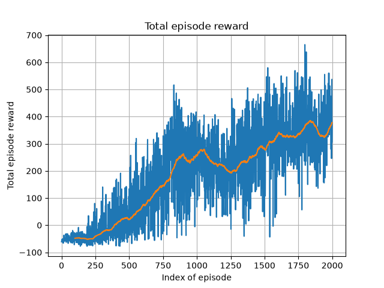
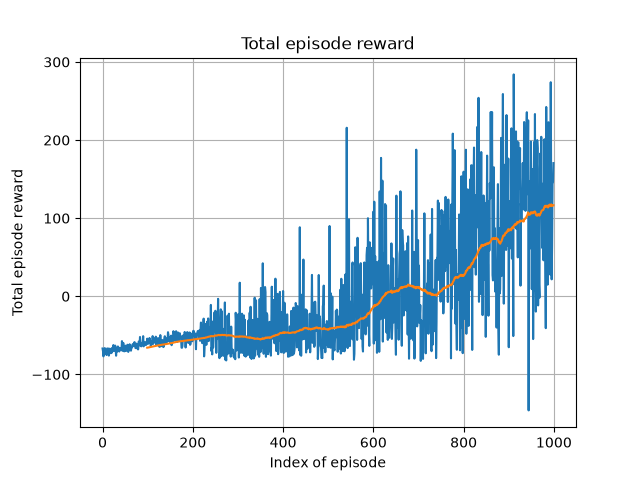
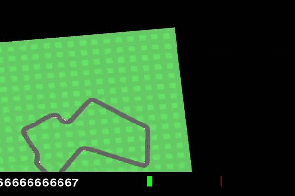

Реализован алгоритм A2C применительно к задаче CarRacing.

Графики показывают, что агент успешно обучается, и после обучения получает в среднем 350 баллов за эпизод.
В чистом виде A2C не удалось настроить обучение, чтобы получался приемлемый результат.
Поэтому был реализован модифицированный механизм PPO.
Агент научился тормозить через резкое вращение рулем. Причем тормоза агент совсем не использует.

Лучший результат был достигнут при использовании стандартной стратегии и ограничения максимального газа в 10%.
В данном случае машина едет почти на полном газе все время и немного сбрасывает скорость на поворотах, срезая по траве.

